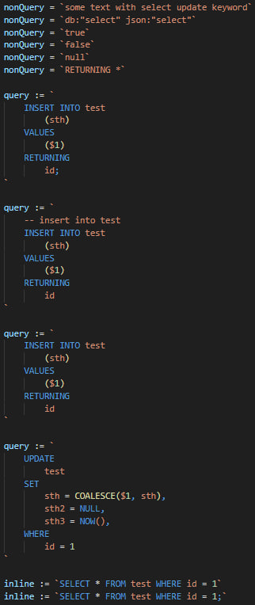
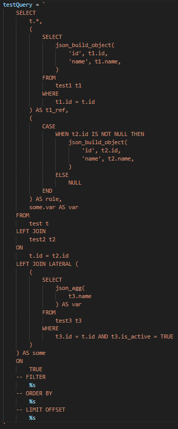
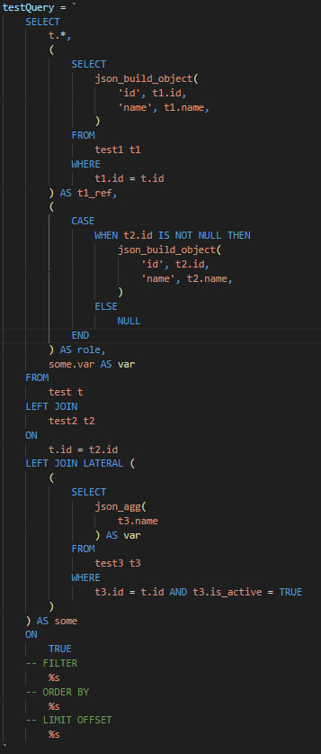

# Go Raw SQL Syntax

Highlight SQL syntax in Go raw strings.
No need to start with `sql :=` or `--sql` comment.
No need to end with `;` semicolon.

## Examples



Before | After
:---: | :---:
 | 

## Installing

You can install the latest version of the extension via the Visual Studio Marketplace <br/>

<a href="https://marketplace.visualstudio.com/items?itemName=LightSoulDev.go-raw-sql-syntax">

</a>

Alternatively, open Visual Studio code, press `Ctrl+P` or `Cmd+P` and type:

```bash
    > ext install go-raw-sql-syntax
```

## Source Code

The source code is available on GitHub [lightSoulDev/vscode-go-raw-sql-syntax](https://github.com/lightSoulDev/vscode-go-raw-sql-syntax).

## Configuration

Is not available yet.